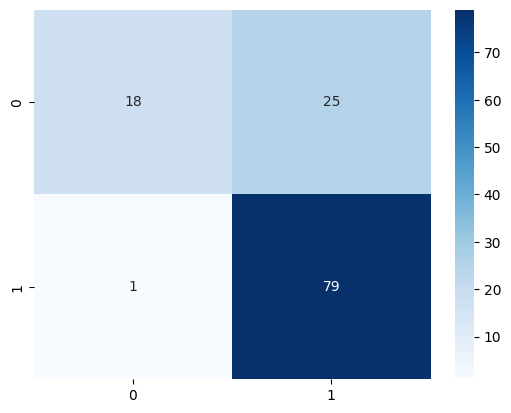
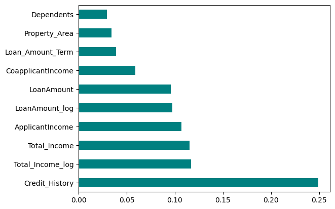

  <a href="https://www.credly.com/badges/fd073c9c-4879-402f-a507-83a7a8f068ae/public_url">
    
" width="200" alt="2026 Microsoft Student Ambassador">
  </a>

# Loan Approval Prediction System 💰

## 📌 Project Overview
This project is part of my **Data Science Project Series**. It aims to automate the loan eligibility process using Machine Learning, helping financial institutions minimize credit risk and improve operational efficiency.

## 🎓 Academic Context
* **University:** Mansoura National University
* **Faculty:** Engineering (AI Department)

## 🛠️ Technical Workflow
1. **Data Cleaning:** Handled missing values in features like `Credit_History`, `LoanAmount`, and `Gender`.
2. **Exploratory Data Analysis (EDA):** Visualized the impact of education and credit history on loan status.
3. **Feature Engineering:** - Created `Total_Income` (Applicant + Co-applicant).
   - Applied **Log Transformation** to handle outliers in income and loan amounts.
4. **Modeling:** Developed and compared **Logistic Regression** and **Random Forest Classifier**.

## 📊 Key Results
* **Logistic Regression Accuracy:** ~78.86%
* **Random Forest Accuracy:** ~75.61%
* **Primary Insights:** `Credit_History` is the strongest predictor of loan approval.

## 📂 Project Structure
* `madfhantr.csv`: Training dataset.
* `Loan_Prediction_Analysis.ipynb`: Full source code with detailed explanations.
## 📈 Visual Insights

#### 1. Model Performance (Confusion Matrix)
Look at how the model handles False Positives vs. False Negatives.

#### 2. Business Determinants (Feature Importance)
As expected, **Credit History** is by far the most critical factor for loan approval.

